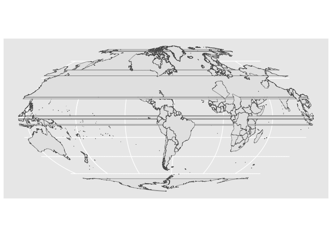
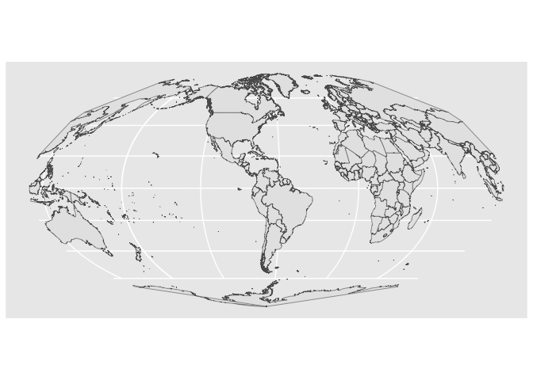
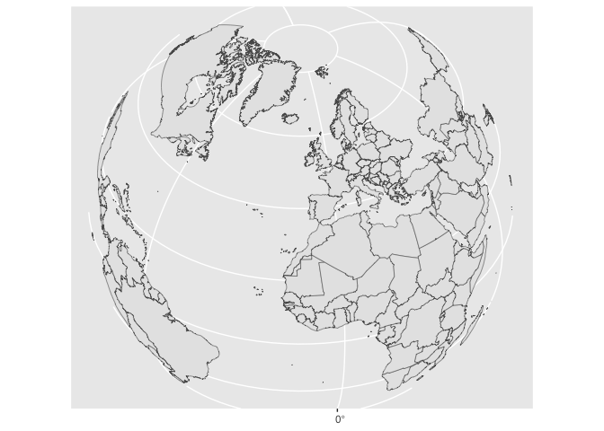
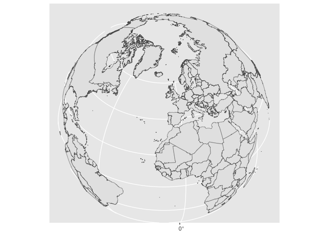
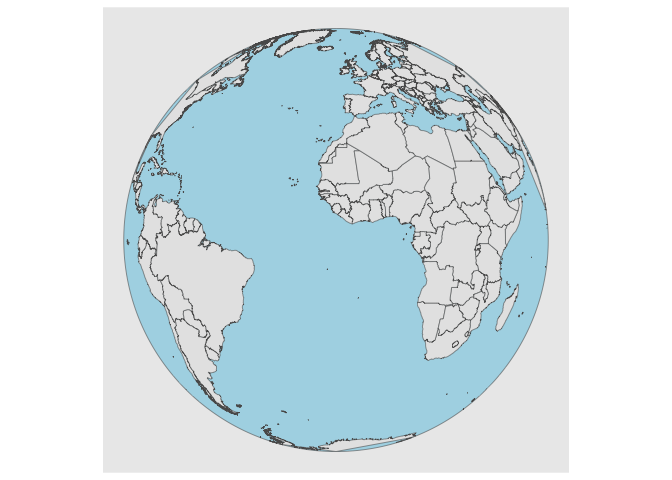
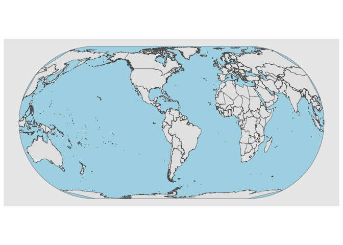
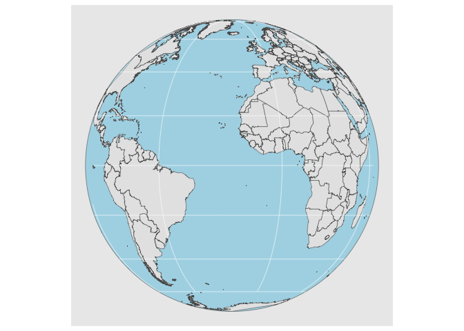

# sfhelper

License: MIT

For more information please contact <mark.ravina@austin.utexas.edu>

## Installation

To install from GitHub use the devtools package

    devtools::install_github("histmr/sfhelper")

## Functions

### geolocate()

The geolocate() function takes a data frame with a column of place names
(toponyms) and a column of regions, specified by their two-digits ISO
codes. The default colums names are “place” and “iso”. The function uses
the API of the World Historical Gazeteer (<https://whgazetteer.org/>) to
generate a four column data frame with the toponym, ISO code, longitude,
and latitude. Many toponyms will return multiple hits. You will probably
want to import a data frame, but here’s an example of a data frame
created within R

    library(sfhelper)
    df <- data.frame("place"=c("Tokyo","Edo","Prague","Prague"),"iso"=c("JP","JP","CZ",""))
    geolocate(df,place,iso)

    ##    toponym codes     long     lat
    ## 2    Tokyo    JP 139.6917 35.6895
    ## 3    Tōkyō  NULL 139.5000 35.7500
    ## 4    Tokyo  NULL 139.7500 35.6667
    ## 5    Tokyo    JP 139.6917 35.6895
    ## 6    Tōkyō  NULL 139.5000 35.7500
    ## 7   Prague    CZ       NA      NA
    ## 8   Prague    US -92.2667 34.2833
    ## 9   Prague    US -96.6833 35.4833
    ## 10  Prague    US -96.8000 41.3000
    ## 11 Bohemia  NULL -87.1500 30.4833
    ## 12 Bohemia  NULL  14.4333 50.1000
    ## 13   Praha  NULL -93.5667 44.5333

### st\_transform\_repair

Changing the meridian when re-projecting sf objects often creates broken
polygons and other unwanted artifacts. This function repairs most common
errors. For example, when re-projecting the world map from
**rnaturalearth**, the **st\_transform\_repair()** function corrects for
the new meridian.

    library("rnaturalearth")
    library("tidyverse")
    library("sf")

    world.sf <- ne_countries(scale = "medium", returnclass = "sf")

    new_crs <- "+proj=moll +lat_1=-10 +lon_0=-70"

    new.sf <- st_transform(x = world.sf, crs = new_crs)
    ggplot() + geom_sf(data=new.sf)

    new.sf <- st_transform_repair(x = world.sf, crs= new_crs)
    ggplot() + geom_sf(data=new.sf)

In an orthographic projection, the US disappears if we re-project to
“+proj=ortho +lat\_0=40 +lon\_0=-12”.

    new_crs <- "+proj=ortho +lat_0=40 +lon_0=-12"
    ggplot() + geom_sf(data= world.sf %>% st_transform(new_crs))

The **st\_transform\_repair()** fixes the broken polygons

    ggplot() + geom_sf(data=world.sf %>% st_transform_repair(new_crs))

### st\_transform\_outline

As in the examples above, re-projected maps sometimes lack an “edge of
the globe” graticule line. The **st\_transform\_outline()** function
generates that line as an **sf** object. Using with **fill** in
**ggplot()**, the new object can be used to represent oceans. At present
it does NOT work for orthographic projections with changes in
**+lat\_0=0**

    new_crs <- "+proj=ortho +lat_0=0 +lon_0=-12"
    ggplot() + 
      geom_sf(data=st_transform_outline(new_crs), fill="lightblue") +
      geom_sf(data=world.sf %>% st_transform_repair(new_crs))

    new_crs <- "+proj=eck4 +lon_0=-70"
    ggplot() + 
        geom_sf(data=st_transform_outline(new_crs), fill="lightblue") +
        geom_sf(data=world.sf %>% st_transform_repair(new_crs))

These transforms make the graticule disappear, but we can restore it
with **st\_graticule()**

    new_crs <- "+proj=ortho +lon_0=-20"
    new.sf <- world.sf %>% st_transform_repair(new_crs)
    new_graticule.sf <- st_graticule(new.sf) %>% st_transform(new_crs)
    ggplot() + geom_sf(data=st_transform_outline(crs=new_crs), fill="lightblue") +
      geom_sf(data=new.sf) +
      geom_sf(data=new_graticule.sf, color="white", linewidth=0.3, alpha=0.7)

